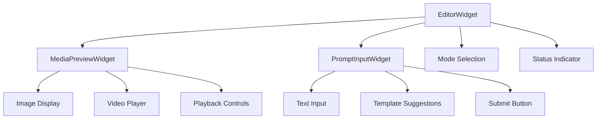

# EditorWidget - AI Image/Video Editor Component

A comprehensive AI-powered image and video editor widget with preview capabilities and prompt-based editing.

## Overview

The `EditorWidget` is a PyQt6-based component that provides a complete editing interface for AI-driven image and video generation and manipulation. It combines a media preview area with a prompt input system and mode switching capabilities.

## Features

- **Multi-format Preview**: Supports images (PNG, JPG, GIF) and videos (MP4, AVI, MOV, etc.)
- **Multiple Editing Modes**: 
  - Text to Image
  - Image to Video
  - Text to Video
  - Image Edit
  - Video Edit
- **Smart Prompt Input**: Integrated with template management and autocomplete
- **Responsive Layout**: Resizable preview and control areas with splitter
- **Task Integration**: Seamlessly integrates with workspace task system
- **Internationalization**: Full i18n support

## Architecture

### Component Hierarchy



### Layout Structure

```
┌─────────────────────────────────────────┐
│         EditorWidget                    │
│  ┌───────────────────────────────────┐ │
│  │   Preview Area (Top - 70%)        │ │
│  │   ┌─────────────────────────────┐ │ │
│  │   │  MediaPreviewWidget         │ │ │
│  │   │  - Image/Video Display      │ │ │
│  │   │  - Playback Controls        │ │ │
│  │   │  - Aspect Ratio Support     │ │ │
│  │   └─────────────────────────────┘ │ │
│  └───────────────────────────────────┘ │
│  ════════ Resizable Splitter ═════════ │
│  ┌───────────────────────────────────┐ │
│  │   Control Area (Bottom - 30%)     │ │
│  │   ┌─────────────┬───────────────┐ │ │
│  │   │ Mode Switch │ Prompt Input  │ │ │
│  │   │ - Combo Box │ - Text Edit   │ │ │
│  │   │ - Status    │ - Templates   │ │ │
│  │   └─────────────┴───────────────┘ │ │
│  └───────────────────────────────────┘ │
└─────────────────────────────────────────┘
```

## Usage

### Basic Usage

```python
from PySide6.QtWidgets import QApplication, QMainWindow
from app.ui.editor import EditorWidget
from app.data.workspace import Workspace

app = QApplication([])
workspace = Workspace("/path/to/workspace", "project_name")

# Create editor widget
editor = EditorWidget(workspace)

# Connect signals
editor.mode_changed.connect(lambda mode: print(f"Mode: {mode}"))
editor.prompt_submitted.connect(lambda mode, prompt: print(f"{mode}: {prompt}"))

# Show widget
editor.show()
app.exec()
```

### Advanced Usage

```python
# Set specific editing mode
editor.set_mode(EditorWidget.MODE_TEXT_TO_IMAGE)

# Get current mode
current_mode = editor.get_current_mode()

# Access sub-components
preview_widget = editor.get_preview_widget()
prompt_widget = editor.get_prompt_widget()

# Load media file
preview_widget.load_file("/path/to/image.png")

# Clear prompt
editor.clear_prompt()

# Set processing state
editor.set_processing(True)
```

## Signals

### `mode_changed(str)`
Emitted when the editing mode is changed.
- **Parameter**: `mode` - The new mode identifier (e.g., "text_to_image")

### `prompt_submitted(str, str)`
Emitted when the user submits a prompt.
- **Parameters**: 
  - `mode` - Current editing mode
  - `prompt` - User-entered prompt text

## Editing Modes

| Mode | Constant | Description |
|------|----------|-------------|
| Text to Image | `MODE_TEXT_TO_IMAGE` | Generate images from text descriptions |
| Image to Video | `MODE_IMAGE_TO_VIDEO` | Convert static images to videos with animation |
| Text to Video | `MODE_TEXT_TO_VIDEO` | Generate videos from text descriptions |
| Image Edit | `MODE_IMAGE_EDIT` | Edit existing images with prompts |
| Video Edit | `MODE_VIDEO_EDIT` | Edit existing videos with prompts |

## Components

### Preview Widget (`MediaPreviewWidget`)

- **Location**: Top section (70% default height)
- **Features**:
  - Image display with scaling
  - Video playback with controls
  - GIF animation support
  - Multiple aspect ratios
  - Seamless video looping

### Control Area

#### Mode Selection
- Dropdown combo box for mode switching
- Visual feedback on mode change
- Context-aware prompt placeholders

#### Prompt Input (`PromptInputWidget`)
- Expandable text area
- Template autocomplete
- Character counter
- Submit button
- Keyboard shortcuts (Enter to submit)

## Styling

The component uses a dark theme consistent with the application's design language:

- **Colors**:
  - Background: `#1e1f22` (preview), `#2b2d30` (control)
  - Borders: `#505254`
  - Accent: `#4080ff`
  - Text: `#E1E1E1`

- **Responsive Design**:
  - Minimum preview height: 300px
  - Minimum control height: 150px
  - Resizable splitter between sections

## Integration with Workspace

The editor automatically integrates with the workspace task system:

```python
# Task lifecycle events
async def on_task_create(self, params):
    """Called when a new task is created"""
    
async def on_task_execute(self, task: Task):
    """Called when a task starts executing"""
    
async def on_task_finished(self, result: TaskResult):
    """Called when a task completes"""
    
def on_timeline_switch(self, item: TimelineItem):
    """Called when timeline selection changes (must be non-async)"""
```

**Important**: The `on_timeline_switch` method must be **non-async** (synchronous) because it's triggered via blinker signals which don't support coroutines. The other event handlers can be async.

## Testing

Run the test file to see the component in action:

```bash
python test/test_editor.py
```

This will open a standalone window with the editor widget, allowing you to:
- Switch between different editing modes
- Enter prompts and submit them
- See console output of mode changes and submissions

## Dependencies

- PySide6 (Qt6 bindings)
- app.ui.preview.MediaPreviewWidget
- app.ui.prompt_input.PromptInputWidget
- app.ui.base_widget.BaseTaskWidget
- app.data.workspace.Workspace
- utils.i18n_utils (translation support)

## File Structure

```
app/ui/editor/
├── __init__.py          # Module exports
├── editor.py            # Main EditorWidget implementation
└── README.md            # This file

test/
└── test_editor.py       # Test/demo application
```

## Future Enhancements

- [ ] Additional editing modes (style transfer, upscaling, etc.)
- [ ] Real-time preview of prompt changes
- [ ] History of recent prompts
- [ ] Batch processing support
- [ ] Export settings panel
- [ ] Keyboard shortcut customization
- [ ] Plugin system for custom modes

## License

Part of the Filmeto AI Video Editor project.
