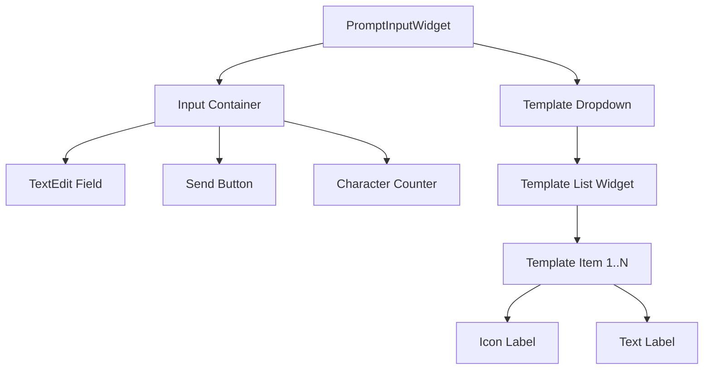
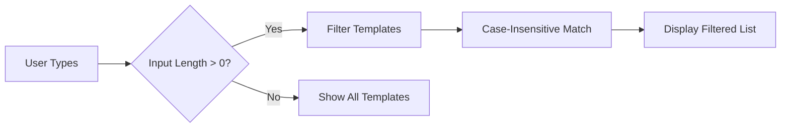
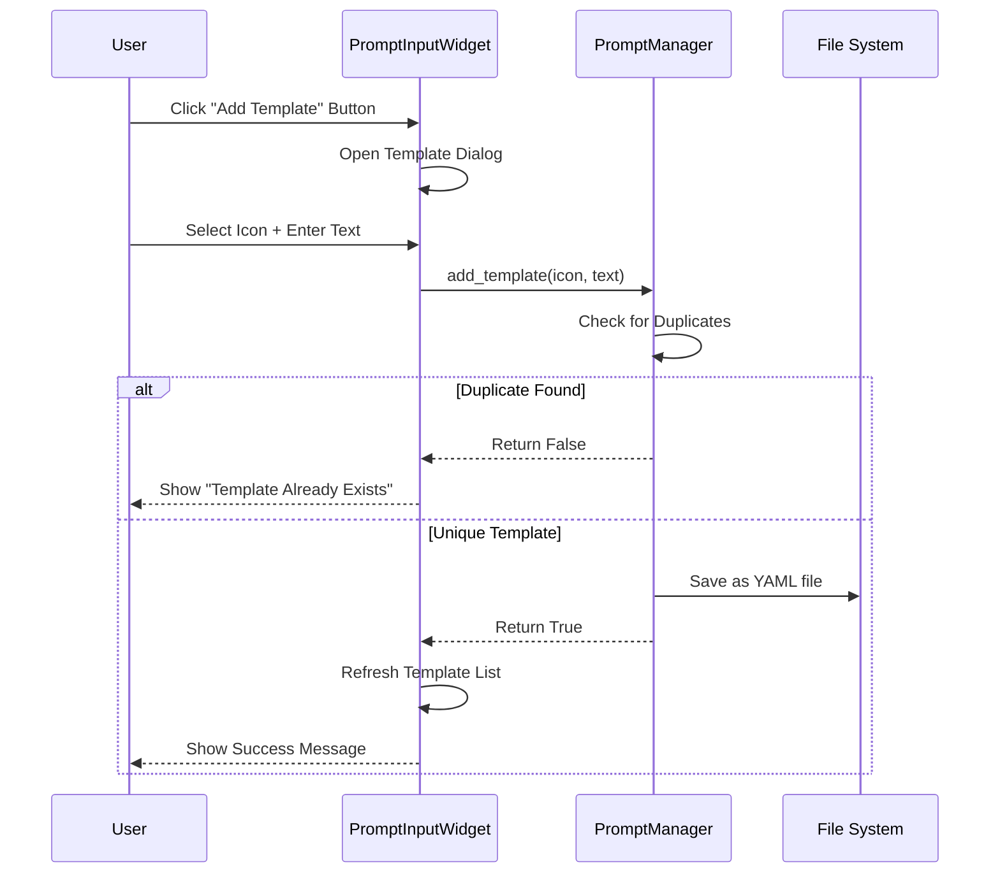
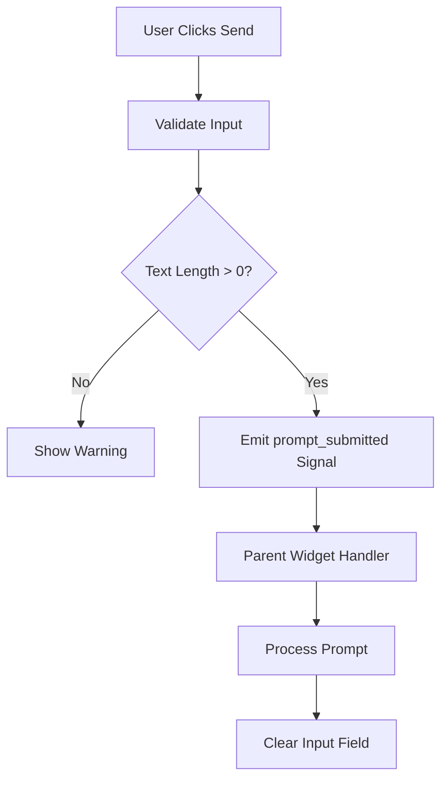
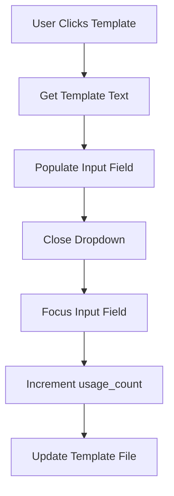
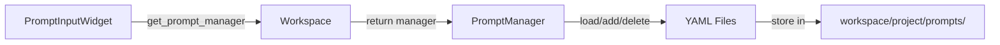

# Prompt Input Component Design

## Overview

This design document outlines the implementation strategy for a reusable Prompt Input Component within the Filmeto application. The component provides an adaptive text input interface with template management capabilities, following the application's existing dark theme aesthetic and architectural patterns.

## Technology Stack & Dependencies

- **UI Framework**: PySide6 (Qt for Python)
- **Styling**: QSS (Qt Style Sheets) - Dark theme
- **State Management**: Qt Signals and Slots pattern
- **Data Persistence**: YAML-based file storage
- **Base Classes**: Inherits from `BaseWidget`

## Component Architecture

### Component Definition

The Prompt Input Component is a composite UI widget consisting of:

| Sub-Component | Responsibility | Visual Characteristics |
|--------------|----------------|------------------------|
| Input Field | Multi-line text entry with auto-expansion | Rounded corners, placeholder support, adaptive width |
| Send Button | Trigger action submission | Icon-based, positioned adjacent to input |
| Character Counter | Display current prompt length | Dynamic text display, appears on hover/focus |
| Template Dropdown | Show and select prompt templates | Filterable list with icons and text |
| Template Manager | Add and manage templates | Duplicate detection, persistence layer |

### Component Hierarchy



### File Structure

```
app/
└── ui/
    └── prompt_input/
        ├── __init__.py
        ├── prompt_input_widget.py     # Main widget implementation
        └── template_item_widget.py    # Template list item widget

app/
└── data/
    └── workspace.py                   # Extended with PromptManager

workspace/
└── {project_name}/
    └── prompts/                       # Template storage directory
        ├── template_001.yaml
        ├── template_002.yaml
        └── ...
```

## Component Interface Design

### PromptInputWidget - Public API

| Method/Signal | Type | Description |
|--------------|------|-------------|
| `__init__(workspace, parent)` | Constructor | Initialize component with workspace reference |
| `set_placeholder(text)` | Method | Set input field placeholder text |
| `get_prompt_text()` | Method | Retrieve current prompt text |
| `clear_prompt()` | Method | Clear input field content |
| `prompt_submitted` | Signal | Emitted when send button clicked, passes prompt text |
| `prompt_changed` | Signal | Emitted when text changes, passes updated text |

### PromptManager - Public API

| Method | Parameters | Return | Description |
|--------|-----------|--------|-------------|
| `load_templates()` | None | List[PromptTemplate] | Load all templates from storage |
| `add_template(icon_path, text)` | icon_path: str, text: str | bool | Add new template with deduplication |
| `delete_template(template_id)` | template_id: str | bool | Remove template from storage |
| `search_templates(query)` | query: str | List[PromptTemplate] | Filter templates by text match |

### Data Model

**PromptTemplate Structure** (YAML Format):

| Field | Type | Description | Required |
|-------|------|-------------|----------|
| id | string | Unique identifier (UUID) | Yes |
| icon | string | Relative path to icon file | Yes |
| text | string | Template prompt content | Yes |
| created_at | timestamp | Creation timestamp | Yes |
| usage_count | integer | Number of times used | No |

## Component Behavior Specification

### Input Field Behavior

#### Adaptive Height Expansion

```mermaid
stateDiagram-v2
    [*] --> Default: Initial State
    Default --> Expanded: Mouse Enter + Text Overflow
    Expanded --> Default: Mouse Leave + No Focus
    Expanded --> Focused: Click Inside
    Focused --> Expanded: Focus Lost
    Default --> Focused: Click Inside
    Focused --> Default: Focus Lost
```

**State Transitions:**

| State | Height | Visibility | Trigger Conditions |
|-------|--------|------------|-------------------|
| Default | Single-line (40px) | Counter hidden | No hover, no focus |
| Expanded | Multi-line (120px max) | Counter visible | Mouse hover OR focus |
| Focused | Multi-line (120px max) | Counter visible, scrollable | Active text input |

#### Character Counter Display

- **Position**: Bottom-right corner of input field
- **Format**: `{current_length} characters`
- **Visibility**: Shows when mouse enters input area or field gains focus
- **Update Frequency**: Real-time on each text change

### Template Dropdown Behavior

#### Matching and Filtering



**Matching Algorithm:**
- **Trigger**: Automatic as user types in input field
- **Match Criteria**: Case-insensitive substring search on template text
- **Display Behavior**: Dropdown appears below input with matched results
- **Selection**: Click or keyboard navigation (Up/Down arrows, Enter to select)

#### Template Addition Workflow



**Deduplication Logic:**
- **Comparison Basis**: Exact text match (case-sensitive)
- **Collision Handling**: Prevent save, notify user
- **Icon Handling**: Different icons with same text are considered duplicates

## Styling Strategy

### Dark Theme Color Palette

| Element | Background Color | Border Color | Text Color | Hover/Focus State |
|---------|-----------------|--------------|------------|-------------------|
| Input Field (Default) | `#2b2d30` | `#505254` | `#E1E1E1` | Border: `#4080ff` |
| Input Field (Expanded) | `#2b2d30` | `#4080ff` | `#E1E1E1` | Shadow: `0 4px 12px rgba(64, 128, 255, 0.3)` |
| Send Button | `#3d3f4e` | None | `#E1E1E1` | Background: `#4080ff` |
| Character Counter | Transparent | None | `#888888` | N/A |
| Template Dropdown | `#2c2c2c` | `#505254` | `#E1E1E1` | Item Background: `#3a3c3f` |
| Template Item (Selected) | `#4080ff` | None | `#FFFFFF` | N/A |

### QSS Class Names (To Be Added to `style/dark_style.qss`)

```
#prompt_input_container
#prompt_text_edit
#prompt_send_button
#prompt_char_counter
#prompt_template_dropdown
.template_item
.template_item_icon
.template_item_text
```

### Visual Specifications

**Input Field:**
- **Border Radius**: 8px
- **Padding**: 8px (all sides)
- **Font Size**: 14px
- **Default Width**: Adaptive to parent container
- **Minimum Width**: 200px
- **Maximum Height (Expanded)**: 120px with vertical scrollbar

**Send Button:**
- **Size**: 36x36px
- **Border Radius**: 18px (circular)
- **Icon**: Unicode character `\ue846` (send icon from iconfont)
- **Position**: Right-aligned, vertically centered with input

**Template Items:**
- **Height**: 40px per item
- **Icon Size**: 24x24px
- **Spacing**: 8px between icon and text
- **Padding**: 8px horizontal, 4px vertical

## Data Flow Architecture

### Prompt Submission Flow



### Template Selection Flow



## PromptManager Implementation Strategy

### Integration with Workspace

**Location**: `app/data/workspace.py`

**Extension Method**:

| Method | Integration Point | Responsibility |
|--------|------------------|----------------|
| `__init__` | Workspace initialization | Create PromptManager instance |
| `get_prompt_manager()` | Public accessor | Return PromptManager reference |

### Storage Architecture

**Directory Structure:**
```
workspace/{project_name}/prompts/
├── template_{uuid_1}.yaml
├── template_{uuid_2}.yaml
└── ...
```

**File Naming Convention**:
- Pattern: `template_{uuid}.yaml`
- UUID Generation: Use Python's `uuid.uuid4()` for unique identifiers
- One template per file for atomic operations

**YAML Template Example:**
```
id: "550e8400-e29b-41d4-a716-446655440000"
icon: "textures/prompt_icons/text.png"
text: "Generate a cinematic scene with dramatic lighting"
created_at: "2024-01-15T10:30:00"
usage_count: 5
```

### Template Operations

**Load Templates:**
1. Scan `prompts/` directory for `.yaml` files
2. Parse each file using `yaml_utils.load_yaml()`
3. Validate required fields (id, icon, text)
4. Return sorted list (by usage_count descending, then created_at)

**Add Template (with Deduplication):**
1. Iterate existing templates to check text match
2. If duplicate found, return False with error message
3. Generate new UUID for template ID
4. Create YAML structure with current timestamp
5. Save to `prompts/template_{uuid}.yaml`
6. Return True on success

**Delete Template:**
1. Locate file by template ID
2. Remove file from filesystem
3. Update in-memory cache if exists

## Event Handling & State Management

### Key Interactions

| Event | Handler | Behavior |
|-------|---------|----------|
| Input Field Focus In | `_on_input_focus_in()` | Expand height, show counter |
| Input Field Focus Out | `_on_input_focus_out()` | Collapse if no hover |
| Mouse Enter Input | `enterEvent()` | Expand height, show counter |
| Mouse Leave Input | `leaveEvent()` | Collapse if no focus |
| Text Changed | `_on_text_changed()` | Update counter, filter templates |
| Send Button Click | `_on_send_clicked()` | Validate and emit signal |
| Template Item Click | `_on_template_selected()` | Populate input, close dropdown |
| Add Template Button | `_show_add_template_dialog()` | Open modal dialog |

### State Variables

| Variable | Type | Purpose | Default Value |
|----------|------|---------|---------------|
| `_is_expanded` | bool | Track expansion state | False |
| `_has_focus` | bool | Track input focus | False |
| `_mouse_over` | bool | Track mouse hover | False |
| `_current_text` | str | Store input content | "" |
| `_selected_template` | PromptTemplate | Last selected template | None |

## Integration Points

### Parent Widget Integration

**Typical Usage Pattern:**

```
Parent Widget → Create PromptInputWidget
              → Connect to prompt_submitted signal
              → Handle submitted prompt text
              → Optionally clear prompt after processing
```

**Signal Connection Example (Conceptual):**

| Parent Component | Signal Connection | Handler Responsibility |
|-----------------|-------------------|------------------------|
| Task Creation Dialog | `prompt_submitted` → `_create_task_with_prompt()` | Submit task to workspace |
| Timeline Editor | `prompt_submitted` → `_add_timeline_item()` | Create timeline entry |
| Plugin Tools | `prompt_submitted` → `_execute_tool()` | Pass prompt to AI tool |

### Workspace Data Access



## Accessibility & Usability

### Keyboard Navigation

| Key | Context | Action |
|-----|---------|--------|
| Tab | Input field | Move focus to send button |
| Shift+Tab | Send button | Move focus to input field |
| Enter | Input field (default) | Submit prompt |
| Ctrl+Enter | Input field | Insert line break |
| Escape | Template dropdown open | Close dropdown |
| ↑/↓ | Template dropdown | Navigate items |
| Enter | Template selected | Apply template |

### Placeholder Text

**Default Placeholder**: "Enter your prompt here..."

**Behavior**:
- Displays in light gray (`#888888`) when field is empty
- Disappears when user types or focuses
- Reappears when field is cleared and loses focus

### Width Adaptation

**Responsive Behavior**:
- Inherits parent container width by default
- Maintains minimum width of 200px
- Send button remains fixed at 36px width
- Input field flexibly adjusts: `parent_width - send_button_width - margins`

## Testing Strategy

### Unit Testing Requirements

| Test Category | Test Cases | Success Criteria |
|--------------|------------|------------------|
| Component Rendering | Initial state display | Input visible, button enabled, counter hidden |
| State Transitions | Hover/focus expansion | Height changes to 120px, counter appears |
| Text Input | Character counting | Counter updates in real-time |
| Template Filtering | Search matching | Only matched templates shown |
| Deduplication | Adding duplicate template | Rejects with error message |
| File Operations | Template save/load | YAML files created/read correctly |
| Signal Emission | Send button click | `prompt_submitted` signal emits with text |

### Integration Testing Scenarios

1. **Workflow Test**: Add template → Select template → Modify text → Submit → Verify task creation
2. **Persistence Test**: Add templates → Restart application → Verify templates loaded
3. **Concurrent Access**: Multiple windows accessing same template storage
4. **Error Handling**: Invalid YAML files, missing icon files, disk full scenarios

## Performance Considerations

### Optimization Strategies

| Concern | Strategy | Implementation Detail |
|---------|----------|----------------------|
| Template Loading | Lazy loading | Load templates on first dropdown open |
| Filtering Performance | Debouncing | 300ms delay before filtering on input |
| File I/O | Caching | In-memory template cache, reload on demand |
| UI Responsiveness | Async operations | Use Qt signals for non-blocking updates |

### Resource Limits

- **Maximum Templates**: 500 templates (practical limit)
- **Max Prompt Length**: 10,000 characters (soft limit with warning)
- **Icon File Size**: Maximum 100KB per icon
- **Template Text Length**: Maximum 2,000 characters

## Internationalization (i18n) Support

### Translatable Strings

| UI Element | Translation Key | Default (English) |
|------------|----------------|-------------------|
| Placeholder | `prompt.placeholder` | "Enter your prompt here..." |
| Character Counter | `prompt.char_count` | "{count} characters" |
| Send Button Tooltip | `prompt.send_tooltip` | "Submit prompt" |
| Add Template Button | `prompt.add_template` | "Add Template" |
| Duplicate Error | `prompt.duplicate_error` | "This template already exists" |
| Empty Input Warning | `prompt.empty_warning` | "Please enter a prompt" |

### Implementation Approach

- Use `tr()` function from `utils.i18n_utils` for all user-facing strings
- Connect to `translation_manager.language_changed` signal
- Update UI text in `_update_ui_text()` method following existing pattern

## Constraints & Limitations

### Technical Constraints

- Must inherit from `BaseWidget` for consistent styling
- Limited to PySide6 Qt widgets (no web views or external UI libraries)
- Style modifications only via QSS in shared stylesheet
- File operations must use existing `yaml_utils` module

### Design Constraints

- Must maintain dark theme consistency across all states
- Cannot exceed 200px height in expanded state (to prevent covering other UI)
- Icon files must be stored in centralized `textures/` directory
- Template files must remain human-readable YAML format

### Functional Constraints

- No cloud synchronization of templates (local storage only)
- No template sharing between different workspace projects
- No template versioning or history tracking
- Deduplication based solely on text content (icons ignored in comparison)
